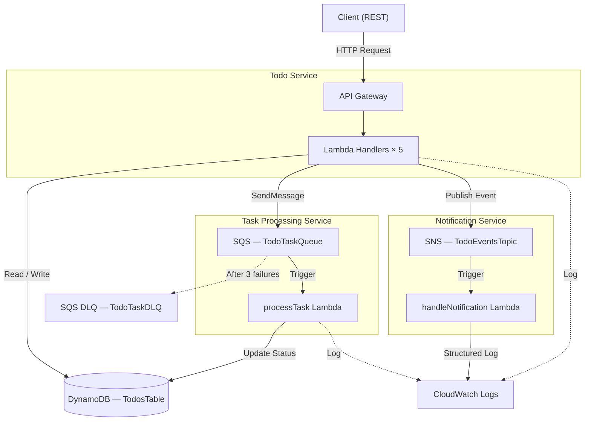
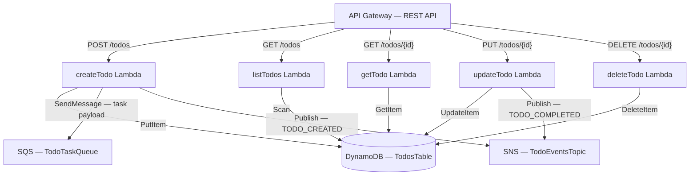
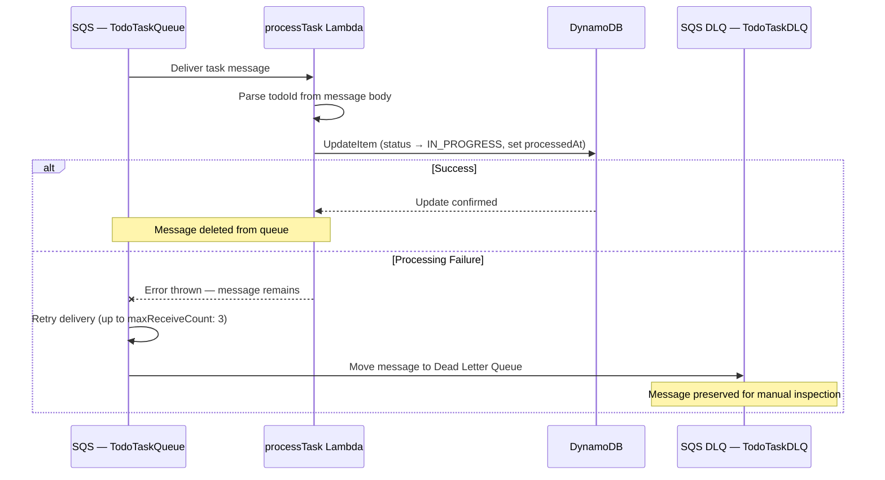
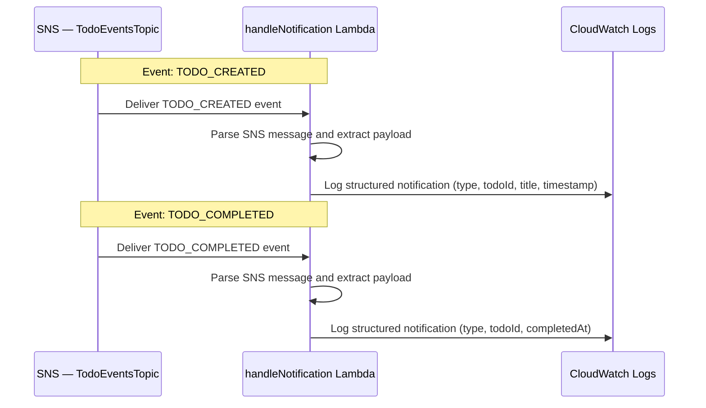
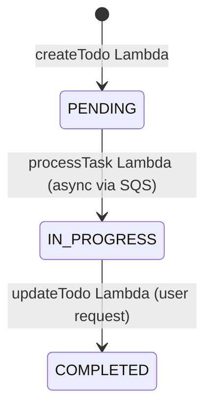
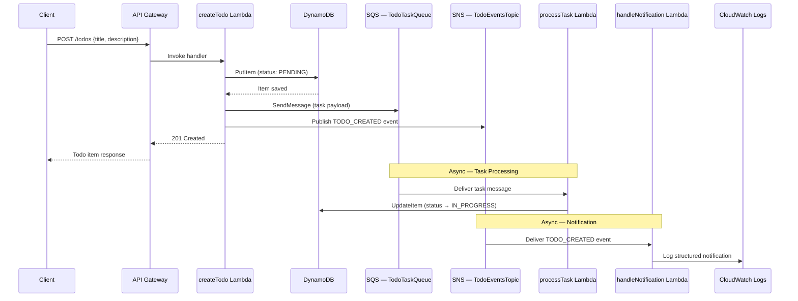
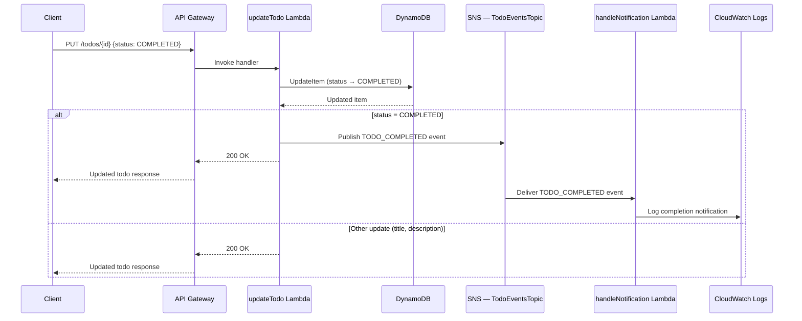

# Solution Architecture: Todo Management System

## AWS Serverless Microservices

---

### Document Metadata

| Field | Value |
|---|---|
| **Project** | Todo Management System — Backend Assessment |
| **Author** | Suvra Samajder |
| **Date** | March 2026 |
| **Target Deployment** | AWS `ap-south-1` (Mumbai) |
| **Architecture Pattern** | Event-Driven Microservices |
| **IaC Framework** | Serverless Framework v3 |
| **Runtime** | Node.js 18.x with TypeScript |

---

### 1. Executive Summary

This system implements a Todo Management API using an event-driven serverless microservices architecture on AWS. Three independently deployable services handle distinct responsibilities: a **Todo Service** exposes a REST API for CRUD operations, a **Task Processing Service** performs asynchronous background processing via SQS, and a **Notification Service** reacts to domain events published through SNS. The architecture prioritizes loose coupling, resilience through dead-letter queues, and operational visibility through structured logging — reflecting the same patterns used in production serverless systems at scale.

---

### 2. System Overview

#### 2.1 High-Level Architecture

The following diagram shows the three microservices, their AWS resource dependencies, and the primary data and event flows between them.



#### 2.2 Architecture Principles

- **Event-driven decoupling** — Services communicate through SQS and SNS, never through direct invocation. Adding a new consumer requires zero changes to the publisher.
- **Single responsibility per service** — Each microservice owns exactly one domain concern: API, processing, or notification.
- **Async processing with dead-letter safety** — Failed SQS messages are retried up to 3 times, then routed to a DLQ for inspection rather than being silently dropped.
- **Least-privilege IAM** — Every Lambda function's IAM role is scoped to the specific resource ARNs it needs. No `Resource: "*"` statements.
- **Structured observability** — All handlers emit JSON-structured logs with correlation fields (`requestId`, `todoId`, `timestamp`) to CloudWatch.
- **Infrastructure as Code** — All resources are defined in `serverless.yml` and deployed via CloudFormation. Nothing is created manually in the console.

---

### 3. Service Architecture

#### 3.1 Todo Service

The Todo Service is the only externally-facing service, owning the REST API, DynamoDB table, and domain event publishing after successful writes.



| Method | Endpoint | Description | Request Body | Success Response |
|---|---|---|---|---|
| `POST` | `/todos` | Create a new todo | `{ title, description }` | `201` — Created todo object |
| `GET` | `/todos` | List all todos | — | `200` — Array of todo objects |
| `GET` | `/todos/{id}` | Get a specific todo | — | `200` — Single todo object |
| `PUT` | `/todos/{id}` | Update a todo | `{ title?, description?, status? }` | `200` — Updated todo object |
| `DELETE` | `/todos/{id}` | Delete a todo | — | `200` — Deletion confirmation |

---

#### 3.2 Task Processing Service

The Task Processing Service consumes SQS messages and transitions newly created todos from `PENDING` to `IN_PROGRESS`.



**Idempotency:** The `UpdateItem` call uses `ConditionExpression: #status = :pending AND attribute_exists(todoId)` to guard against duplicate SQS deliveries regressing state and stale references to deleted todos creating ghost records. A `ConditionalCheckFailedException` is caught, logged at `WARN`, and the message is acknowledged without retry.

| Configuration | Value | Purpose |
|---|---|---|
| `maxReceiveCount` | 3 | Maximum delivery attempts before DLQ routing |
| `visibilityTimeout` | 60s | Must be ≥ 6× Lambda timeout (10s) to prevent duplicate delivery during active processing |
| DLQ | `TodoTaskDLQ` | Captures messages that failed all retry attempts for manual triage |

---

#### 3.3 Notification Service

The Notification Service subscribes to the SNS topic and emits structured notification logs — in production, the transport swaps to SES or Twilio while the event contract remains identical.



| Event Type | Trigger Condition | Key Payload Fields |
|---|---|---|
| `TODO_CREATED` | New todo is created via `POST /todos` | `todoId`, `title`, `status`, `createdAt` |
| `TODO_COMPLETED` | Todo status updated to `COMPLETED` via `PUT /todos/{id}` | `todoId`, `title`, `status`, `completedAt` |

---

### 4. Data Architecture

#### 4.1 DynamoDB Table Design

| Property | Value |
|---|---|
| **Table Name** | `TodosTable` |
| **Partition Key** | `todoId` (String) |
| **Billing Mode** | PAY_PER_REQUEST (On-Demand) |
| **GSI** | `StatusIndex` — Partition Key: `status`, Sort Key: `createdAt` |

**Access Patterns:**

| Access Pattern | Operation | Key / Index Used |
|---|---|---|
| Get todo by ID | `GetItem` | `todoId` (table PK) |
| List all todos | `Scan` | Table scan |
| Query todos by status | `Query` | `StatusIndex` GSI |
| Create todo | `PutItem` | `todoId` (table PK) |
| Update todo | `UpdateItem` | `todoId` (table PK) |
| Delete todo | `DeleteItem` | `todoId` (table PK) |

#### 4.2 Data Model

```typescript
interface Todo {
  todoId: string;
  title: string;
  description: string;
  status: 'PENDING' | 'IN_PROGRESS' | 'COMPLETED';
  createdAt: string;   // ISO 8601
  updatedAt: string;   // ISO 8601
  processedAt?: string; // ISO 8601 — set by Task Processing Service
}
```

#### 4.3 Status Flow

The following state diagram shows the valid status transitions and the enforced directionality.



**Transition Enforcement:** The `updateTodo` handler validates status transitions against a whitelist of allowed source → target pairs (`PENDING → IN_PROGRESS`, `IN_PROGRESS → COMPLETED`). Invalid transitions (e.g., `COMPLETED → PENDING`) return `400` with `{ error: "Invalid status transition from COMPLETED to PENDING" }`. This prevents clients from arbitrarily regressing state and ensures the lifecycle model documented here is enforced at the application layer.

---

### 5. Event Flow Architecture

#### 5.1 Create Todo — End-to-End Flow

Complete synchronous and asynchronous chain triggered by a `POST /todos` request.



**Note on Delete operations:** Delete does not publish a domain event. The Notification Service scope is limited to creation and completion lifecycle events. A `TODO_DELETED` event would be added if downstream services needed to react to deletions (e.g., archiving related data or cleaning up external references).

#### 5.2 Update Todo — Completion Flow

Conditional event publishing when a todo's status is updated to `COMPLETED`.



---

### 6. Infrastructure Architecture

#### 6.1 AWS Services

| Service | Purpose | Configuration |
|---|---|---|
| **API Gateway** | REST API entry point | Regional endpoint, `ap-south-1`, CORS enabled via `cors: true` on all HTTP events |
| **Lambda** | Compute for all 7 functions | Node.js 18.x, 128 MB memory, 10s timeout |
| **DynamoDB** | Primary data store | On-demand capacity, single table + GSI |
| **SQS** | Task processing queue | Standard queue, 60s visibility timeout (6× Lambda timeout) |
| **SQS (DLQ)** | Dead letter queue | `maxReceiveCount: 3` redrive policy |
| **SNS** | Domain event pub/sub | Standard topic, Lambda subscription |
| **CloudWatch** | Logging and metrics | Log group per Lambda, 14-day retention |
| **IAM** | Access control | Scoped roles per function |
| **S3** | Deployment artifacts | Auto-created by Serverless Framework. Stores zipped Lambda packages and CloudFormation templates per deployment. |
| **CloudFormation** | Resource provisioning | Managed by Serverless Framework |

#### 6.2 IAM and Security

| Function(s) | Permissions | Resource Scope |
|---|---|---|
| CRUD Lambdas | `dynamodb:PutItem`, `GetItem`, `UpdateItem`, `DeleteItem`, `Scan`, `Query` | `TodosTable` ARN and its indexes |
| createTodo | `sqs:SendMessage` | `TodoTaskQueue` ARN |
| createTodo, updateTodo | `sns:Publish` | `TodoEventsTopic` ARN |
| processTask | `dynamodb:UpdateItem` | `TodosTable` ARN |
| handleNotification | (no additional data permissions) | — |

For production, a JWT-based API Gateway Authorizer, WAF rules for IP/origin restrictions, and DynamoDB encryption at rest (enabled by default) would harden the security boundary.

#### 6.3 Deployment Architecture

| Order | Service | Rationale |
|---|---|---|
| 1 | `todo-service` | Creates shared resources: DynamoDB table, SQS queue, SQS DLQ, SNS topic |
| 2 | `task-processing-service` | References SQS queue ARN created by service 1 |
| 3 | `notification-service` | References SNS topic ARN created by service 1 |

---

### 7. Observability and Resilience

#### 7.1 Logging Strategy

All Lambda functions use structured JSON logging with a consistent schema:

| Field | Description | Example |
|---|---|---|
| `level` | Log severity | `INFO`, `ERROR`, `WARN` |
| `message` | Human-readable description | `"Todo created successfully"` |
| `timestamp` | ISO 8601 timestamp | `"2026-03-11T10:30:00.000Z"` |
| `requestId` | Lambda request ID or SQS message ID | `"abc-123-def"` |
| `todoId` | Domain entity identifier | `"todo-uuid-456"` |
| `service` | Originating service name | `"todo-service"` |

#### 7.2 Error Handling

| Layer | Strategy |
|---|---|
| **API handlers** | Try/catch wrapping all handler logic. Validation errors return `400`, missing resources return `404`, unexpected errors return `500` with a generic message (no stack trace leakage). |
| **SQS consumer** | Errors thrown from the handler trigger automatic SQS retry. After `maxReceiveCount` (3) failures, the message is routed to the DLQ. |
| **SNS consumer** | Errors are caught and logged. SNS handles retries per its delivery policy. |
| **All functions** | Error details are logged at `ERROR` level with full context before returning or re-throwing. |

#### 7.3 Monitoring

CloudWatch Log Groups are auto-created per Lambda function, with built-in metrics for invocation count, error rate, duration, and SQS queue depth including DLQ. Production would add CloudWatch Alarms on error rates and DLQ depth, X-Ray distributed tracing, and a unified CloudWatch Dashboard.

---

### 8. Design Decisions and Trade-offs

| Decision | Chosen Approach | Alternative Considered | Rationale |
|---|---|---|---|
| **IaC Framework** | Serverless Framework v3 | AWS SAM, CDK | Best developer experience for Lambda-centric projects. Simpler configuration syntax. Mature plugin ecosystem. Assessment requirement. |
| **Event Bus** | SNS (Simple Notification Service) | EventBridge | Two event types (`TODO_CREATED`, `TODO_COMPLETED`) don't warrant EventBridge's content-based filtering or schema registry. SNS provides native Lambda subscriptions with zero additional configuration. |
| **Database Design** | Single DynamoDB table with GSI | Multiple tables per service | Single entity type (Todo) doesn't justify multi-table overhead. One table simplifies IAM scoping and deployment. GSI on `status` covers the required query pattern. |
| **API Domain** | Default API Gateway URL | Custom domain via Route53 + ACM | Custom domain deprioritized to allocate time toward event flow architecture and error handling — higher-signal areas for the assessment. |
| **Notifications** | Simulated (structured CloudWatch logs) | AWS SES, Twilio, Firebase | Demonstrates the full event-driven pattern without external service dependencies or account verification delays. The handler contract is identical — swapping in SES requires only the transport implementation. |
| **Authentication** | None | API Gateway Authorizer, Cognito | Excluded per assessment scope. Architecture supports adding a JWT authorizer at the API Gateway level with zero handler changes. |
| **Queue Type** | SQS Standard | SQS FIFO | Todo processing doesn't require strict ordering. Standard queue provides higher throughput and simpler configuration. At-least-once delivery is handled via conditional DynamoDB updates. |
| **Idempotency** | DynamoDB `ConditionExpression` on `UpdateItem` | Idempotency table, deduplication with SQS FIFO | `ConditionExpression: #status = :pending` prevents duplicate SQS messages from regressing state. Simpler and zero-cost compared to a separate idempotency store. |
| **Event publish ordering** | Publish to SQS/SNS after DDB write, fire-and-forget | Transactional outbox pattern, DynamoDB Streams | Accepted partial failure window for assessment scope. If the DDB write succeeds but SQS/SNS publish fails, the todo exists without triggering downstream processing. Production would use a transactional outbox or DynamoDB Streams to guarantee event delivery after successful writes. |
| **List operation** | DynamoDB `Scan` with `Limit` and pagination support | GSI-based query on a synthetic partition key | At assessment scale, `Scan` is acceptable. For production datasets, a GSI with cursor-based pagination would replace the scan to avoid throughput scaling issues. |
| **Logging** | Structured JSON to CloudWatch | Third-party (Datadog, Sentry) | CloudWatch is zero-config with Lambda. Structured JSON enables CloudWatch Insights queries without additional tooling. |

---

### 9. Scalability and Performance

**Scaling characteristics:**

- All compute (Lambda, API Gateway) and storage (DynamoDB on-demand) auto-scale with zero provisioning. Cost is proportional to usage.
- SQS provides virtually unlimited throughput and decouples API response time from downstream processing latency.
- SNS fan-out to multiple subscribers is zero-cost at the publisher, enabling new consumers without architectural changes.

**Performance considerations:**

- SQS decoupling keeps `POST /todos` response times fast — the Lambda returns immediately after publishing, without waiting for task processing.
- `listTodos` uses `Scan` with `Limit` and `LastEvaluatedKey` for pagination. At scale, a GSI-based query would replace the scan.
- Cold starts are mitigated by small bundle size and 128 MB memory. Provisioned concurrency would be added for production traffic.

---

### 10. Future Enhancements

| Category | Enhancement | Impact |
|---|---|---|
| **CI/CD** | GitHub Actions pipeline with lint, test, and deploy stages | Automated, auditable deployments |
| **Environments** | Multi-stage deployment (dev / staging / prod) via Serverless Framework stages | Safe rollout and testing |
| **API Security** | JWT-based authentication via API Gateway Lambda Authorizer | Access control |
| **API Management** | Usage plans, throttling, and API keys | Rate limiting and abuse prevention |
| **Custom Domain** | Route53 + ACM certificate + API Gateway custom domain | Professional URL |
| **Alerting** | CloudWatch Alarms on Lambda errors, DLQ depth, and API 5xx rate | Proactive incident detection |
| **Tracing** | AWS X-Ray distributed tracing across all services | End-to-end debugging |
| **Data Protection** | DynamoDB point-in-time recovery and backup schedules | Disaster recovery |
| **Notifications** | SES for email, Twilio for SMS, Firebase for push | Real notification delivery |
| **Multi-region** | DynamoDB Global Tables and multi-region API Gateway | High availability |

---
